# Project Documentation

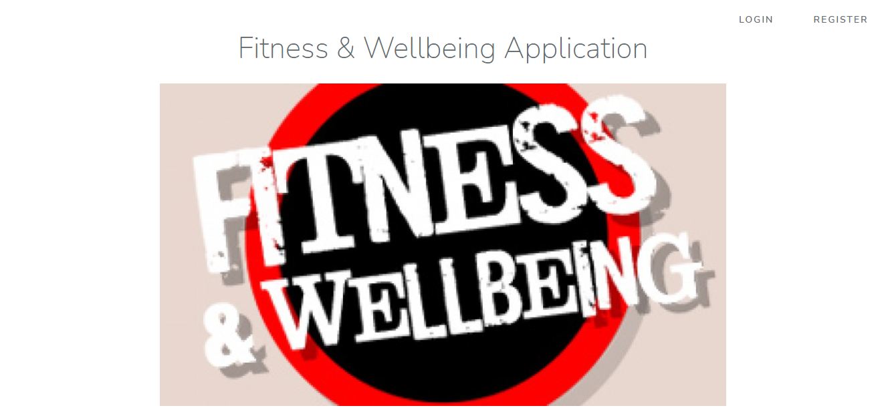

## Introduction

This project tracks the fitness of a user based on workouts and food habits. Users can enter their workout and the system computes how much calories they have burnt. Also, it can track calories in the food intake. The system will show summary workout graphs monthly format. 

## Login Screen

	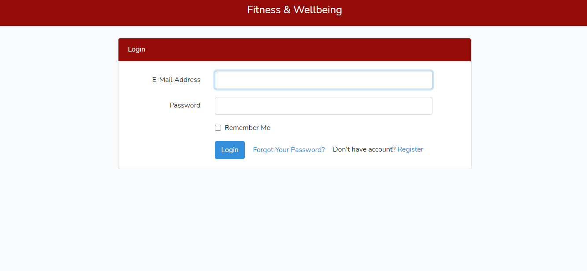

## Register Screen

	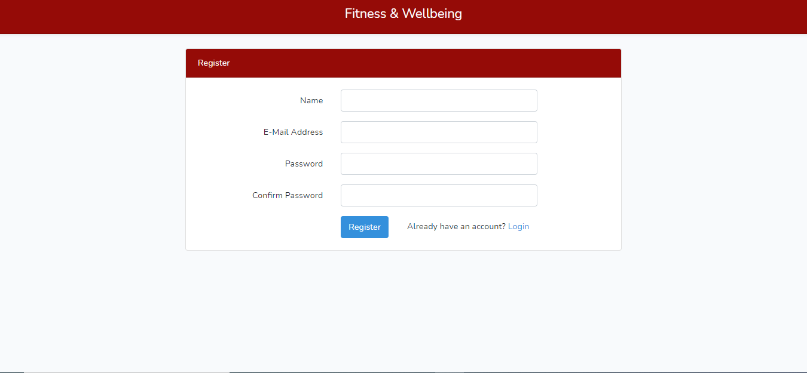

	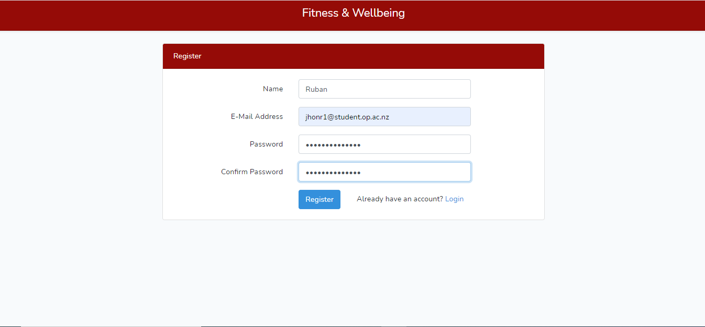

## New user Dashboard Screen

	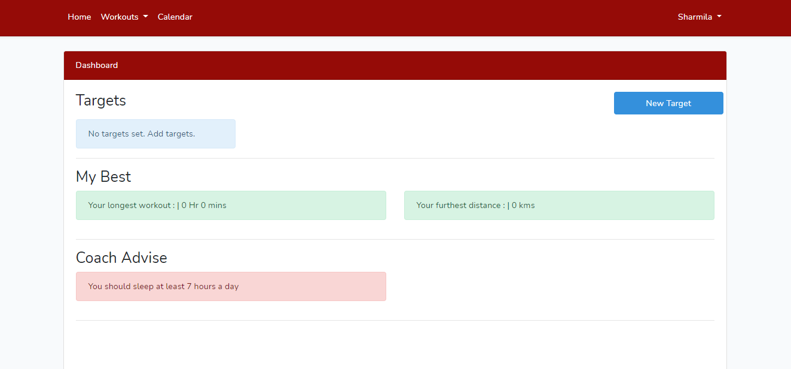

## Existing user Dashboard Screen

	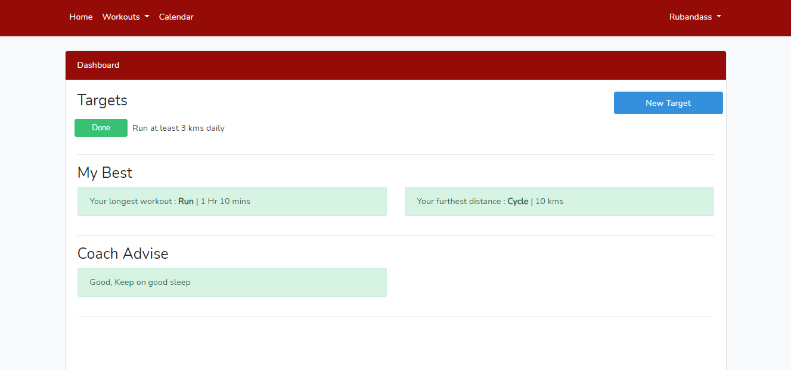

	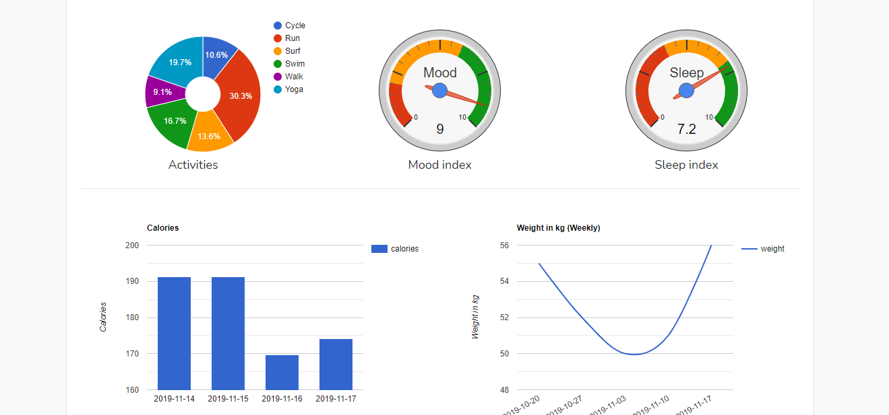

	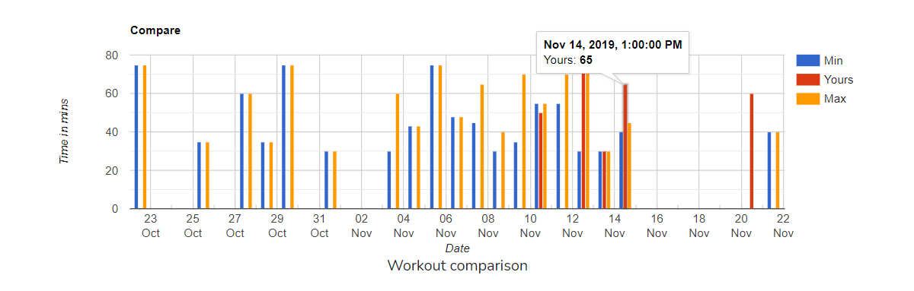

### Activity Screen

	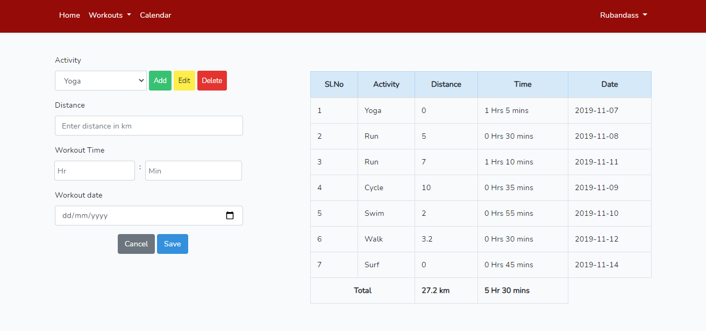

### Alcohol Screen

	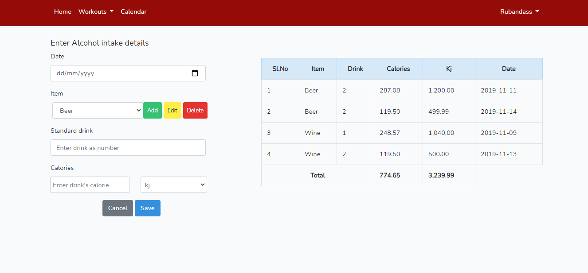

### Sleep Screen

	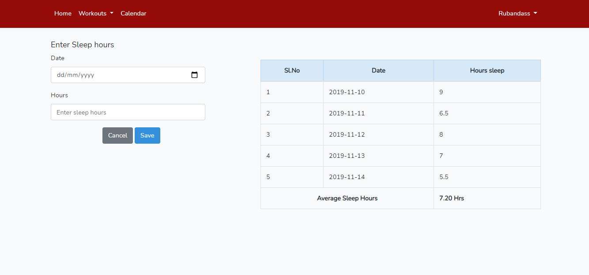

### Mood Screen

	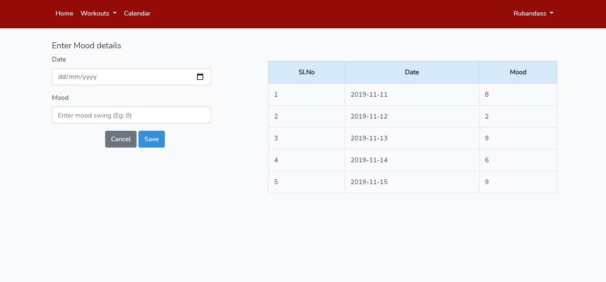

### Snack Screen

	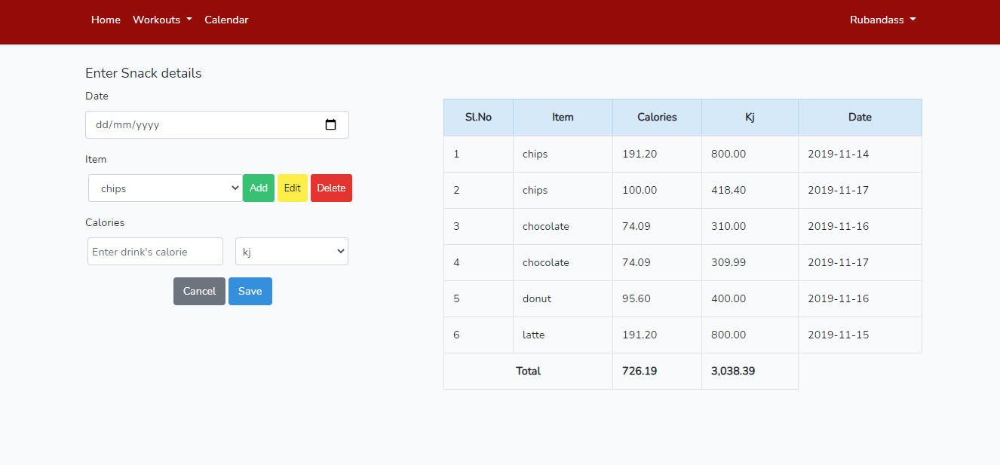

### Weight Screen

	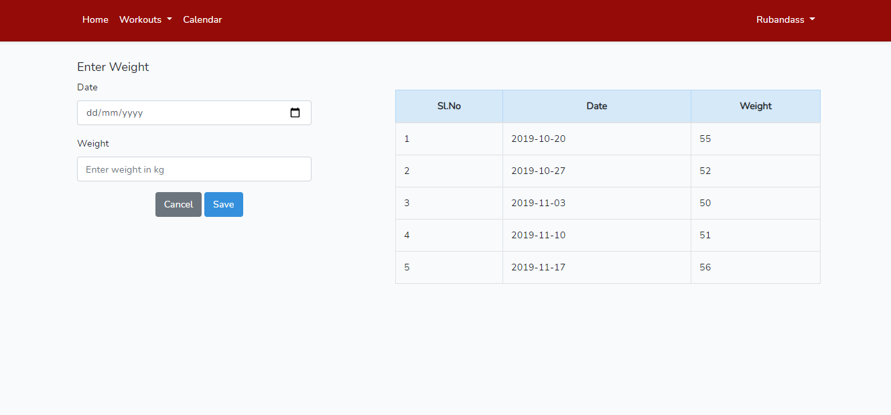

## Calendar Screen

	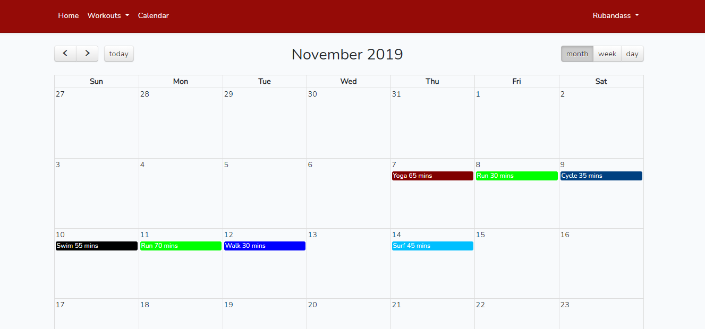

